QuantConnect.com Interaction via API (python edition)
=====================================================

What is it
----------

**quantconnect** is a Python package providing interaction via API with `QuantConnect.com <https://www.quantconnect.com>`_.

Installation Instructions
-------------------------

This package can be installed with pip:

   >>> pip install quantconnect -U

Local installation:

   >>> pip install -e Lean/PythonToolbox

Enter Python's interpreter and type the following commands:

   >>> from quantconnect.api import Api
   >>> api = Api(your-user-id, your-token)
   >>> p = api.list_projects()
   >>> print(len(p['projects']))

For your user id and token, please visit `your account page <https://www.quantconnect.com/account>`_.

Create the package
------------------

Edit setup.py to set the desired package version. Then, create the distribution and upload it with `twine <https://pypi.python.org/pypi/twine>`_.:

   >>> python setup.py sdist
   >>> twine upload  dist/*

Lean Report Creator
-------------------
Create beautiful HTML/PDF reports for sharing your LEAN backtest results in Python.

Instruction on running the program
^^^^^^^^^^^^^^^^^^^^^^^^^^^^^^^^^^^^^^^^^^^^^^^^^
1. Prepare input files
""""""""""""""""""""""
(1) The first input file is the .json file which you can download once you finish your backtesting. You could put this file into a convenient directory, such as ./json/sample.json. Using the API:

   >>> from quantconnect.api import Api
   >>> from json import dump
   >>> api = Api(your-user-id, your-token)
   >>> data = api.read_backtest(project-id, backtest-id)
   >>> with open("./json/sample.json", 'w+') as fp:
   >>>    json.dump(data['result'], fp, ensure_ascii=False)

(2) Replace the file "AuthorProfile.jpg" with your own profile image, but do not change the file name.

(3) Update the "user_data.json" accordingly.

2. Generate report
""""""""""""""""""
Execute the following command to generate your strategy report:

   $ python CreateLeanReport.py --backtest=./json/sample.json --output=./outputs/Report.html --user=user_data.json

3. Get the outputs
""""""""""""""""""
(1) Lean report HTML file defined by "--output"

(2) Individual images in the same directory of the report (remove the `lrc.clean()` statement in "CreateLeanReport.py")

4. Display report from QuantConnect
"""""""""""""""""""""""""""""""""""
For backtests that were executed in QuantConnect, use the API to get the report:

   >>> from IPython.core.display import display, HTML
   >>> from quantconnect.api import Api
   >>> api = Api(your-user-id, your-token)
   >>> lean_report = api.read_backtest_report(project-id, backtest-id)
   >>> display(HTML(lean_report['report']))

Explanation on the meaning of the charts
^^^^^^^^^^^^^^^^^^^^^^^^^^^^^^^^^^^^^^^^^^^^

1. Cumulative Return
""""""""""""""""""""
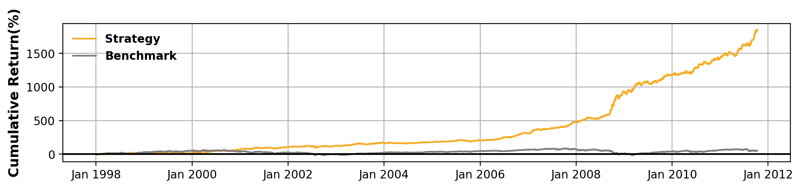
This chart shows the cumulative returns for both your strategy (in orange) and the benchmark (in gray).

The backtest version of this chart is calculated based on daily data. If the original price series in json file is not daily, we will first convert them into daily data.

The live version of this chart is calculated based on minute data. Icons on the chart will show when the live trading started, stopped, or had runtime errors.

2. Daily Return
"""""""""""""""
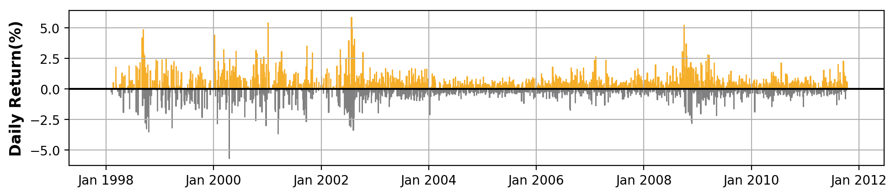
This chart shows the daily returns for your strategy.

When the return is positive, a orange bar will show above the horizontal line; when the return is negative, a gray bar will show below the horizontal line.

3. Top 5 Drawdown Periods
"""""""""""""""""""""""""
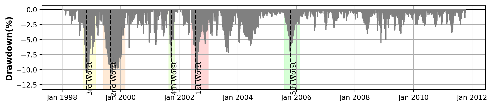
This chart shows the drawdown of each day.

A certain day's drawdown is defined as the percentage of loss compared to the maximum value prior to this day. The drawdowns are calculated based on daily data.

By this definition, we can infer that when certain day's value is the maximum so far, its drawdown is 0.

The top 5 drawdown periods are marked in the chart with different colors.

4. Monthly Returns
""""""""""""""""""
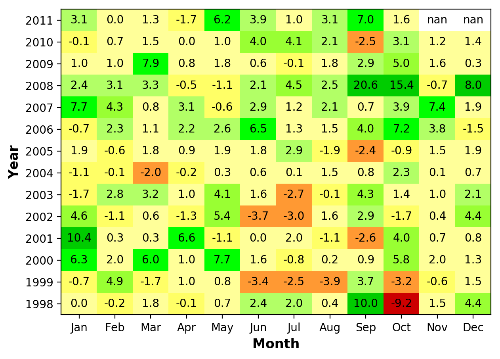
This chart shows the return of each month.

We convert original price series into monthly series, and calculate the returns of each month. 

The green color indicates positive return, the red color indicates negative return, and the greater the loss is, the darker the color is; the yellow color means the gain or loss is rather small; the white color means the month is not included in the backtest period.

The values in the cells are in percentage.

5. Annual Returns
"""""""""""""""""
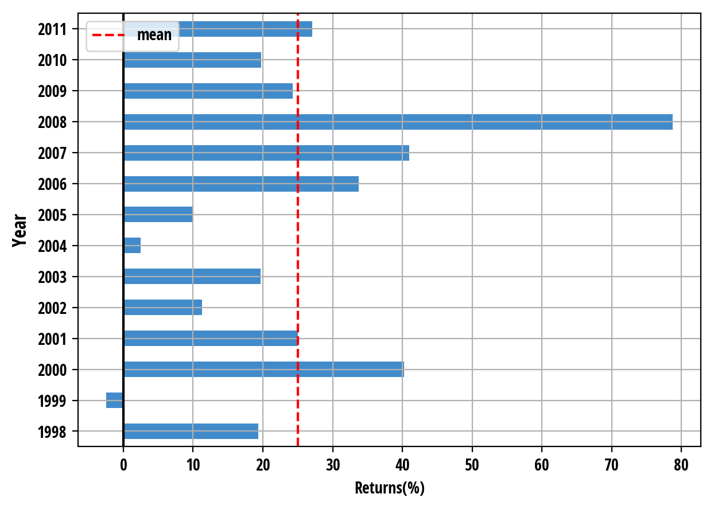
This chart shows the return of each year.

We calculate the total return within each year, shown by the blue bars. The red dotted line represents the average of the annual returns.

One thing needs mentioning: if the backtest covers less than 12 month of a certain year, then the value in the chart is the actual return which is not annualized.

6. Distribution of Monthly Returns
""""""""""""""""""""""""""""""""""
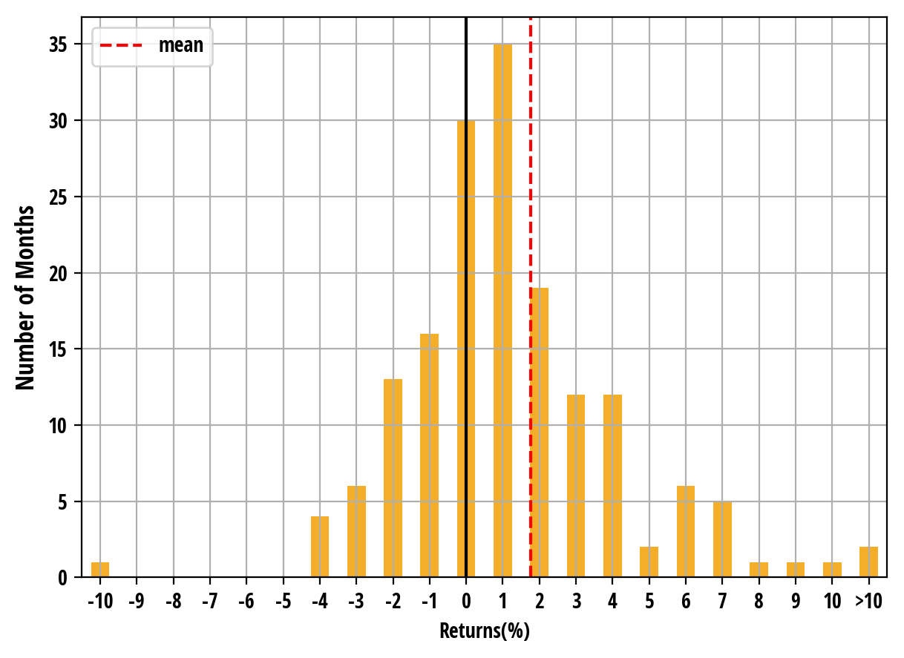
This chart shows the distribution of monthly returns.

The x-axis represents the value of return. The y-axis is the number of months which have a certain return. The red dotted line represents mean value of monthly returns.

7. Crisis Events
""""""""""""""""
9/11

.. image:: outputs//crisis-9-11.png
Lehman Brothers

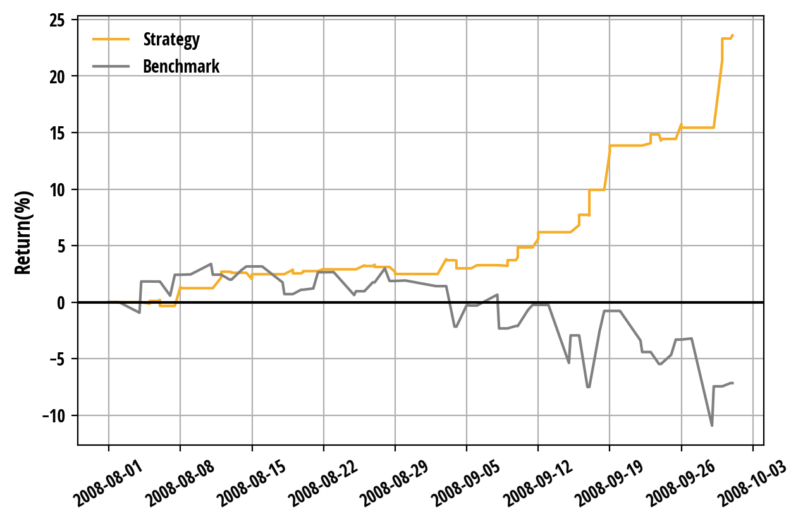
Us Downgrade/European Debt Crisis

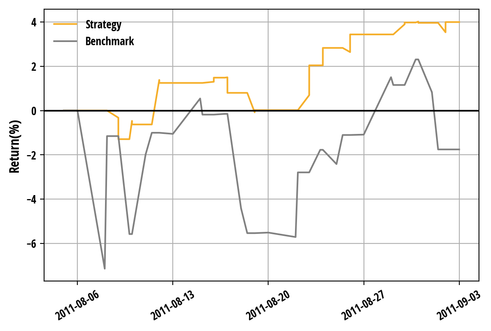
This group of charts shows the behaviors of both your strategy and the benchmark during a certain historical period. 

We set the value of your strategy the same as the benchmark at the beginning of each crisis event, and the lines represent the cumulative returns of your strategy and benchmark from the beginning of this crisis event.

We won't draw the crisis event charts whose time periods are not covered by your strategy.

8. Rolling Portfolio Beta to Equity
"""""""""""""""""""""""""""""""""""
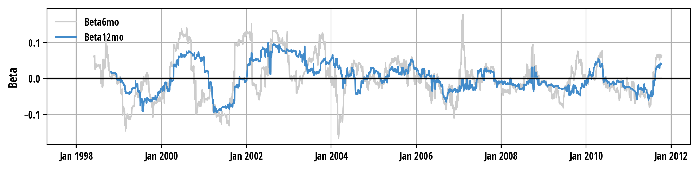
This chart shows the rolling portfolio beta to the benchmark.

This chart is drawn based on daily data. Every day, we calculate the beta of your portfolio to the benchmark over the past 6 months (gray line) or 12 months (blue line). 

A beta close to 1 means the strategy has a risk exposure similar to the benchmark; a beta higher than 1 means the strategy is riskier than the benchmark; a beta close to 0 means the strategy is "market neutral", which isn't much affected by market situation. Beta could also be negative, under which the strategy has opposite risk exposure to the benchmark.

We won't draw this chart when your backtest period is less than 12 months.

9. Rolling Sharpe Ratio
"""""""""""""""""""""""
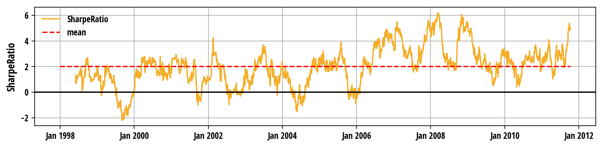
This chart shows the rolling sharpe ratio of your strategy.

The rolling sharpe ratio is calculated on daily data, and annualized. Every day, we calculate the sharpe ratio of your portfolio over the past 6 months, and connect the sharpe ratios into a line. The red dotted line represents the mean value of the total sharpe ratios.

We won't draw this chart when your backtest period is less than 6 months.

10. Net Holdings
""""""""""""""""
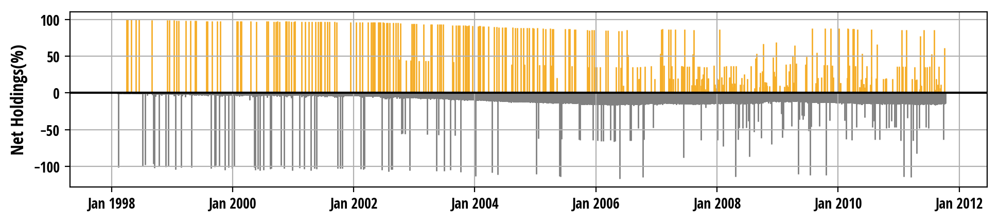
This chart shows the net holdings of your portfolio.

The net holding is the aggregated weight of risky assets in your portfolio. It could be either positive (when your total position is long), negative (when your total position is short) or 0 (when you only hold cash). The net holding changes only if new order is fired.

The chart is drawn based on minute data, which means we aggregate all the risky positions in every minute together.

11. Leverage
""""""""""""
.. image:: outputs//leverage.png
This chart shows the leverage of your portfolio.

The value of the leverage is always non-negative. When you only hold cash, the leverage is 0; a leverage smaller than 1 means you either long assets with money less than your portfolio value or short assets with total value less than your portfolio value; a leverage larger than 1 means you either borrow money to buy assets or short assets whose value is larger than your portfolio value. The leverage changes only if new order is fired.

The chart is drawn based on minute data, which means we aggregate all the risky positions in every minute together.

12. Asset Allocations
"""""""""""""""""""""
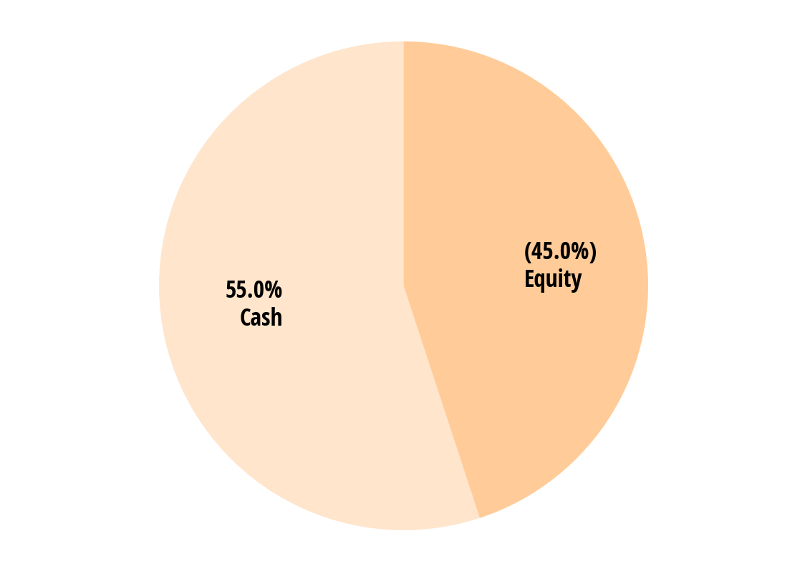
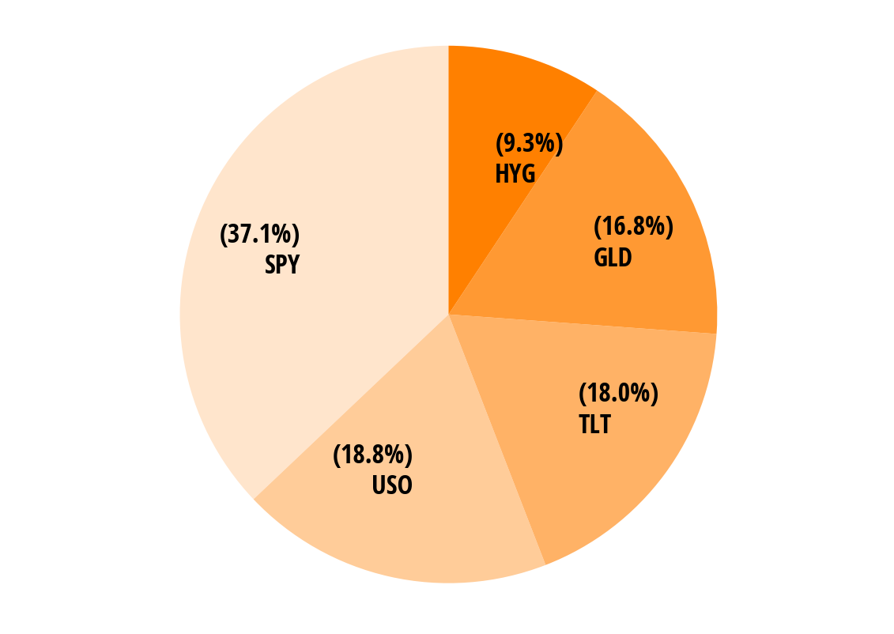
This group of charts show your asset allocations.

It is a time-weighted average of each class of asset to your portfolio. 

The first chart shows the percentages of all the assets together. The sum of the percentages is 100%. When a certain asset has very small percentage and is too small to be shown in the pie chart, it will be incorporated into "others" class. The value of the percentage could be either positive or negative. 

The rest of the pie charts shows the percentages of some more specific asset classes, for example, stocks, foreign exchanges, etc. We won't draw the chart if your portfolio doesn't include any asset within this class.