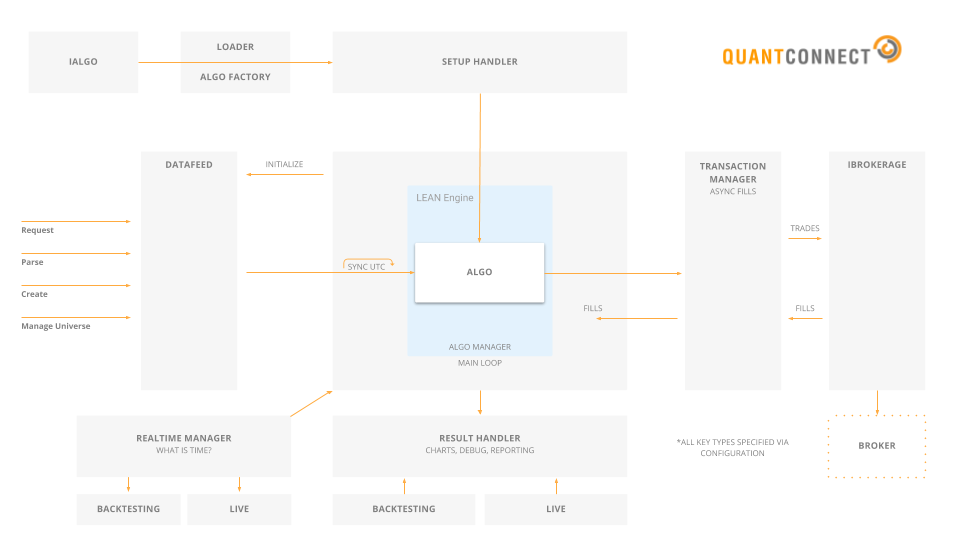

=========

[](https://travis-ci.org/QuantConnect/Lean) &nbsp;&nbsp;&nbsp; [](https://www.quantconnect.com/forum) &nbsp;&nbsp;&nbsp; [](https://www.quantconnect.com/slack)


[Lean Home - https://www.quantconnect.com/lean][1] | [Documentation][2] | [Download Zip][3] | [Docker Hub][8]

----------

## Introduction ##

Lean Engine is an open-source algorithmic trading engine built for easy strategy research, backtesting and live trading. We integrate with common data providers and brokerages so you can quickly deploy algorithmic trading strategies.

The core of the LEAN Engine is written in C#; but it operates seamlessly on Linux, Mac and Windows operating systems. It supports algorithms written in Python 3.6, C# or F#. Lean drives the web based algorithmic trading platform [QuantConnect][4].


## QuantConnect is Hiring! ##
Join the team and solve some of the most difficult challenges in quantitative finance. If you are passionate about algorithmic trading we'd like to hear from you. The below roles are open in our Seattle, WA office. When applying, make sure to mention you came through GitHub: 

- [**Senior UX Developer**](mailto:jared@quantconnect.com): Collaborate with QuantConnect to develop a world leading online experience for a community of developers from all over the world. 

- [**Technical Writers**](mailto:jared@quantconnect.com): Help us improve the QuantConnect and LEAN documentation with hands on tutorials with how to use all the adaptors LEAN offers, and how to setup trading locally. 

- [**Quantitative Development Intern**](mailto:jared@quantconnect.com): If you are a recent or current graduate with a knack for quantitative finance, consider applying for an internship!

## System Overview ##



The Engine is broken into many modular pieces which can be extended without touching other files. The modules are configured in config.json as set "environments". Through these environments you can control LEAN to operate in the mode required. 

The most important plugins are:

 - **Result Processing** (IResultHandler)
   > Handle all messages from the algorithmic trading engine. Decide what should be sent, and where the messages should go. The result processing system can send messages to a local GUI, or the web interface.

 - **Datafeed Sourcing** (IDataFeed)
   > Connect and download data required for the algorithmic trading engine. For backtesting this sources files from the disk, for live trading it connects to a stream and generates the data objects.

 - **Transaction Processing** (ITransactionHandler)
   > Process new order requests; either using the fill models provided by the algorithm, or with an actual brokerage. Send the processed orders back to the algorithm's portfolio to be filled.

 - **Realtime Event Management** (IRealtimeHandler)
   > Generate real time events - such as end of day events. Trigger callbacks to real time event handlers. For backtesting this is mocked-up an works on simulated time. 
 
 - **Algorithm State Setup** (ISetupHandler)
   > Configure the algorithm cash, portfolio and data requested. Initialize all state parameters required.

These are all configurable from the config.json file in the Launcher Project.

## Installation Instructions ##

*We recommend using the docker image.* This is perfectly configured to run out of the box without interfering with your development environment. You can pull this image with `docker pull quantconnect/lean`

Refer to the following readme files for a detailed guide regarding using our docker image with your local IDE:
* [VS Code](.vscode/readme.md)
* [VS](.vs/readme.md)
* [Pycharm](.idea/readme.md)
  

To install locally, download the zip file with the [latest master](https://github.com/QuantConnect/Lean/archive/master.zip) and unzip it to your favorite location. Alternatively, install [Git](https://git-scm.com/downloads) and clone the repo:

```
git clone https://github.com/QuantConnect/Lean.git
cd Lean
```

### macOS 

- Install [Visual Studio for Mac](https://www.visualstudio.com/vs/visual-studio-mac/)
- Open `QuantConnect.Lean.sln` in Visual Studio

Visual Studio will automatically start to restore the Nuget packages. If not, in the menu bar, click `Project > Restore NuGet Packages`.

- In the menu bar, click `Run > Start Debugging`.

Alternatively, run the compiled `exe` file. First, in the menu bar, click `Build > Build All`, then:
```
cd Lean/Launcher/bin/Debug
mono QuantConnect.Lean.Launcher.exe
```

### Linux (Debian, Ubuntu)

- Install [Mono](http://www.mono-project.com/download/#download-lin):
```
sudo apt-get update && sudo rm -rf /var/lib/apt/lists/*
sudo apt-key adv --keyserver hkp://keyserver.ubuntu.com:80 --recv-keys 3FA7E0328081BFF6A14DA29AA6A19B38D3D831EF
echo "deb http://download.mono-project.com/repo/ubuntu stable-xenial/snapshots/5.12.0.226 main" > /etc/apt/sources.list.d/mono-xamarin.list && \
    apt-get update && apt-get install -y binutils mono-complete ca-certificates-mono mono-vbnc nuget referenceassemblies-pcl && \
apt-get install -y fsharp && rm -rf /var/lib/apt/lists/* /tmp/*
```
If you get this error on the last command:
 
**Unable to locate package referenceassemblies-pcl**,
 
run the following command (it works on current version of Ubuntu - 17.10):
```
echo "deb http://download.mono-project.com/repo/ubuntu xenial main" | sudo tee /etc/apt/sources.list.d/mono-official.list
```

```
sudo apt-get update
sudo apt-get install -y binutils mono-complete ca-certificates-mono referenceassemblies-pcl fsharp
```
- Install Nuget
```
sudo apt-get update && sudo apt-get install -y nuget
```
- Restore NuGet packages then compile:
```
nuget restore QuantConnect.Lean.sln
msbuild QuantConnect.Lean.sln
```
If you get: "Error initializing task Fsc: Not registered task Fsc." -> `sudo apt-get upgrade mono-complete`

If you get: "XX not found" -> Make sure Nuget ran successfully, and re-run if neccessary.

If you get: "Confirm ... '.../QuantConnect.XX.csproj.*.props' is correct, and that the file exists on disk." -> Ensure that your installation path is free of [reserved characters](https://docs.microsoft.com/en-us/windows/win32/fileio/naming-a-file)

If you get other errors that lead to the failure of your building, please refer to the commands in "DockerfileLeanFoundation" file for help.

- Run the compiled `exe` file:
```
cd Launcher/bin/Debug
mono ./QuantConnect.Lean.Launcher.exe
```
- Interactive Brokers set up details

Make sure you fix the `ib-tws-dir` and `ib-controller-dir` fields in the `config.json` file with the actual paths to the TWS and the IBController folders respectively.

If after all you still receive connection refuse error, try changing the `ib-port` field in the `config.json` file from 4002 to 4001 to match the settings in your IBGateway/TWS.

### Windows

- Install [Visual Studio](https://www.visualstudio.com/en-us/downloads/download-visual-studio-vs.aspx)
- Open `QuantConnect.Lean.sln` in Visual Studio
- Build the solution by clicking Build Menu -> Build Solution (this should trigger the Nuget package restore)
- Press `F5` to run

Nuget packages not being restored is the most common build issue. By default Visual Studio includes NuGet, if your installation of Visual Studio (or your IDE) cannot find DLL references, install [Nuget](https://www.nuget.org/), run nuget on the solution and re-build the Solution again. 

### Python Support

A full explanation of the Python installation process can be found in the [Algorithm.Python](https://github.com/QuantConnect/Lean/tree/master/Algorithm.Python#quantconnect-python-algorithm-project) project.

### Local-Cloud Hybrid Development. 

You can develop in your IDE and synchronize to the cloud with Skylight. For more information please see the [Skylight Home](https://www.quantconnect.com/skylight).

## Issues and Feature Requests ##

Please submit bugs and feature requests as an issue to the [Lean Repository][5]. Before submitting an issue please read others to ensure it is not a duplicate.

## Mailing List ## 

The mailing list for the project can be found on [LEAN Forum][6]. Please use this to request assistance with your installations and setup questions.

## Contributors and Pull Requests ##

Contributions are warmly very welcomed but we ask you read the existing code to see how it is formatted, commented and ensure contributions match the existing style. All code submissions must include accompanying tests. Please see the [contributor guide lines][7].

All accepted pull requests will get a 2mo free Prime subscription on QuantConnect. Once your pull-request has been merged write to us at support@quantconnect.com with a link to your PR to claim your free live trading. QC <3 Open Source.

## Acknowledgements ##

The open sourcing of QuantConnect would not have been possible without the support of the Pioneers. The Pioneers formed the core 100 early adopters of QuantConnect who subscribed and allowed us to launch the project into open source. 

Ryan H, Pravin B, Jimmie B, Nick C, Sam C, Mattias S, Michael H, Mark M, Madhan, Paul R, Nik M, Scott Y, BinaryExecutor.com, Tadas T, Matt B, Binumon P, Zyron, Mike O, TC, Luigi, Lester Z, Andreas H, Eugene K, Hugo P, Robert N, Christofer O, Ramesh L, Nicholas S, Jonathan E, Marc R, Raghav N, Marcus, Hakan D, Sergey M, Peter McE, Jim M, INTJCapital.com, Richard E, Dominik, John L, H. Orlandella, Stephen L, Risto K, E.Subasi, Peter W, Hui Z, Ross F, Archibald112, MooMooForex.com, Jae S, Eric S, Marco D, Jerome B, James B. Crocker, David Lypka, Edward T, Charlie Guse, Thomas D, Jordan I, Mark S, Bengt K, Marc D, Al C, Jan W, Ero C, Eranmn, Mitchell S, Helmuth V, Michael M, Jeremy P, PVS78, Ross D, Sergey K, John Grover, Fahiz Y, George L.Z., Craig E, Sean S, Brad G, Dennis H, Camila C, Egor U, David T, Cameron W, Napoleon Hernandez, Keeshen A, Daniel E, Daniel H, M.Patterson, Asen K, Virgil J, Balazs Trader, Stan L, Con L, Will D, Scott K, Barry K, Pawel D, S Ray, Richard C, Peter L, Thomas L., Wang H, Oliver Lee, Christian L.


  [1]: https://www.quantconnect.com/lean "Lean Open Source Home Page"
  [2]: https://www.quantconnect.com/lean/docs "Lean Documentation"
  [3]: https://github.com/QuantConnect/Lean/archive/master.zip
  [4]: https://www.quantconnect.com "QuantConnect"
  [5]: https://github.com/QuantConnect/Lean/issues
  [6]: https://www.quantconnect.com/forum/discussions/1/lean
  [7]: https://github.com/QuantConnect/Lean/blob/master/CONTRIBUTING.md
  [8]: https://hub.docker.com/orgs/quantconnect/repositories

